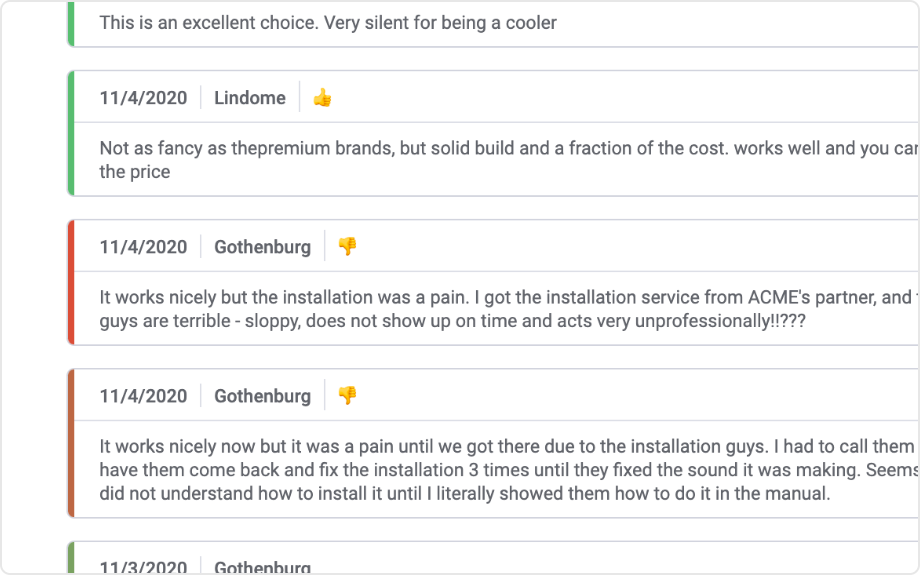

# Text Card Mod for Spotfire®

Visualize long texts in Spotfire. Particularly useful when viewing texts that have varying lengths such as human written comments or log entries.

*This mod was made possible by a great team of 3rd year students of the Bachelor’s program Software Engineering and Management at Gothenburg University (Course DIT827). Thanks to the project owners: Alexander Strand, Emanuel Dellsen, Hartmut Fischer, Jonatan Vaara and Karl Westgårdh.*

## Installation & Use

[Download latest version](https://github.com/spotfiresoftware/spotfire-mod-textcard/releases)

The [Wiki](https://github.com/spotfiresoftware/spotfire-mod-list/wiki) contains step-by-step instruction on how to install and use this Mod in Spotfire®.

## Building the Project

In a terminal window:
- `npm install`
- `npm run build-watch`

In a new terminal window:
- `npm run server`

### Building for production

The development version of bundle.js is uncompressed and not suitable for end-users. Run the following command to compress the bundle:
- `npm run build`

## About Mods for Spotfire®
-   [Spotfire Community Exchange](https://community.spotfire.com/files/): A safe and trusted place to discover ready-to-use Mods
-   [Developer documentation](https://spotfiresoftware.github.io/spotfire-mods/docs/): Introduction and tutorials for Mods developers
-   [Mods examples](https://github.com/TIBCOSoftware/spotfire-mods/): A public repository for examples projects
